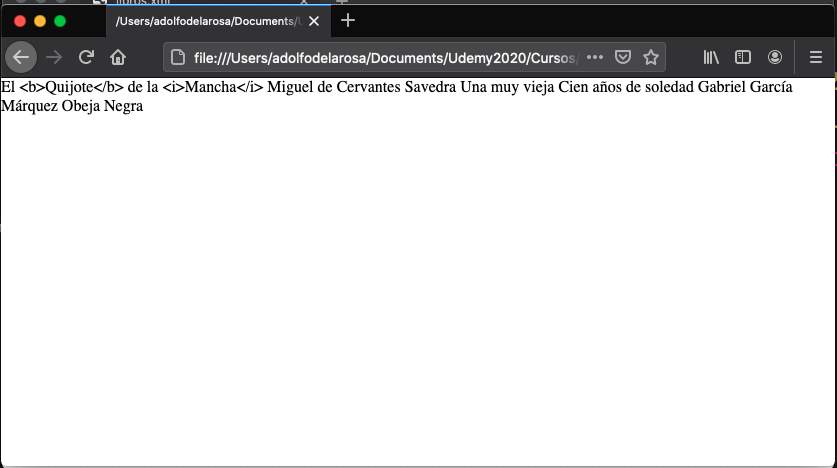
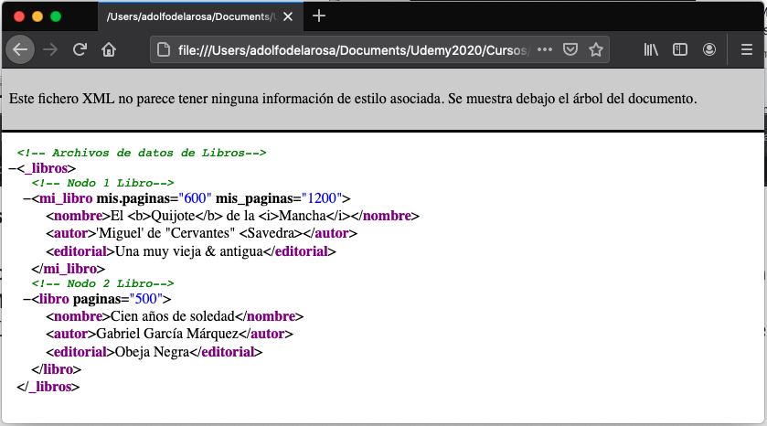

# 01 Introducción a XML • 14 clases • 1h 11m

* 1.- Bienvenida al curso Aprende XML sin dolor 07:39
* 2.- Qué es y qué no es XML 07:31
* 3.- ¿Qué necesitamos para crear un archivo XML? 03:43
* 4.- Las etiquetas de XML 07:06
* 5.- Reglas para un documento XML bien formado 06:55
* 6.- Elementos de un archivo XML 03:20
* 7.- La declaración XML 05:24
* 8.- Los nodos o elementos de XML 04:30
* 9.- Los atributos en un documento XML 03:38
* 10.- Los comentarios en un documento XML 05:25
* 11.- Character Data Section 05:11
* 12.- Instrucciones de proceso o processing instruction 04:11
* 13.- Los caracteres especiales o Entities 04:03
* 14.- Los espacios en blanco en un archivo XML 02:24

## 1.- Bienvenida al curso Aprende XML sin dolor 07:39

### Introducción a XML


* Qué es y qué no es XML
* ¿Qué necesitamos para crear un archivo XML?
* Las etiquetas XML
* Reglas para un documento bien formado
* La declaración XML

Todo lo necesario para crear un archivo XML.

### Los Estilos en Cascada para XML


Alrededor de XML hay muchas herramientas, una de ellas son los estilos en cascada para darle estilos a un XML

* Ligar un archivo en cascada con un documento XML
* Crear el archivo en cascada con las etiquetas generales
* Crear los estilos en cascada para los subnodos de XML
* Manejar los atributos y colocar cadenas antes y después de los nodos

### El Modelo DOM para XML


El DOM nos permite manejar el HTML y el XML, lo haremos a través de JS.

* Introducción al modelo DOM en XML
* Padres, hijos y hermanos en XML
* Cargar un archivo XML por medio de XMLHttpRequest
* Propiedades y métadatos para analízar un archivo XML
* Recorrer un documento XML con las intrucciones DOM

### La herramienta XPath


Otra herramienta importante es el XPath.

* Introducción a XPath
* Elementos de una cadena XPath
* Cargar un archivo externo con `XMLHttpRequest`
* Utilizar las instrucciones `xml.evaluate()` y `xml.iterateNext()`
* Evaluar una expresión XPath en Internet

### XSLT: eXtensible Stylesheet Language Transformation


XSLT nos permite transformar un XML en una página, añade cosas que no se pueden hacer con CSS.

* Introducción a XSLT
* Crear un template con XSL
* Extraer los datos de un documento XML con `value-of`
* Hacer un ciclo en XSL con la etiqueta `<xsl:for-each>`
* Realizar un filtro por medio de la etiqueta `<xsl:for-each>`

### DTD: Definición de Tipo de Documento


Un DTD nos permite saber si un documento XML esta ***bien formado*** y además si es ***valido***, podemos tener ciertas reglas para definir un lenguaje. Esta es una tecnología más vieja que los Schemas.  

* Introducción a la Definición de Tipo de Documento (DTD)
* La Definición de Tipo de Documento interna y externa
* Conceptos generales de modelado de datos
* Definir los elementos de un documento DTD
* Crear un DTD interno y validarlo
* Crear y validar un documento XML con un DTD externo

### Introducción al XML Schema


Con XML Schema, es otra forma de hacer validaciones o archivos de validaciones, es más poderoso que DTD, se apega más a a las reglas del XML, es más complejo que DTD pero nos permite hacer muchas más cosas que DTD. 

* Crear un archivo XSD y llamarlo desde un documento XML
* Definición de los elementos simples, definición de los elementos complejos.
* Los indicadores de orden, número y grupo en XSD
* Definir los atributos en los archivos XSD
* Las restricciones o facets en los archivos XSD
* Definir el archivo XSD y su enlace con XML
* Definir los elementos principales del XSD

En resumen vamos a ver como armamos un documento XML, como lo hacemos bien formado, como hacemos que sea valido, como darle estilo. 

## 2.- Qué es y qué no es XML 07:31

### Introdución a XML


* En 1991 Tim Barnes Lee crea las reglas de la primera versión de HTML. Invento 18 etiquetas para desarrollar el HTML.


* En 1993 Marc Andressen y colaboradores crean Mosaic y Nescape el primer navegador.


* En 1995 Bill Clinton permite el acceso libre a Internet... y lo demás es historia.


* En 1998, ante la enorme explosión de páginas de internet y su necesario intercarcambio de información, la W3C genera la especificación del XML. Ya que HTML nunca fue pensado para manejar datos, se tenian más etiquetas que información.


**XML** significa **eXtensible Markup Lenguage** es decir, nace como una ***extensión*** de HTML, pero sirve para el manejo de los datos.

XML no sustituye a HTML, sino que lo complementa.


* XML se caracteríza por ser sencillo, pero poderoso.
* Tecnologías al rededor de él lo hacen fundamental en el desarrollo Web, como son:
   * AJAX
   * RSS
   * WebService
   * y un largo etcétera

XML se caracteríza por ser muy sencillo, cualquier dispositivo puede tener un XML, teléfonos, TV, moviles, etc.


* XML no es un sustituto de HTML, aunque el estándar XHTML trata de reunir a ambos.
* Al rededor de este lenguaje XML, tendremos otras especificaciones como DTD, XSLT o XPath.
* Incluso se puede utilizar estilos en cascada (CSS) en documentos XML.

XHTML domina las páginas Web hasta antes de aparecer HTML5.


* Todas las especificaciones del lenguaje se encuentran en la página de W3C.
http://www.w3.org/XML/

## 3.- ¿Qué necesitamos para crear un archivo XML? 03:43

* Un Editor
* Un Navegador

## 4.- Las Etiquetas de XML 07:06

Vamos a crear nuestro primer archivo XML donde vamos a guardar información sobre Libros en nuestras etiquetas XML.

XML cuenta con una etiqueta inicial que es opcional.
Tenemos una etiqueta inicial llamada etiqueta raíz que generalmente se nombra en plural, en este caso es `<libros></libros>` todas las demas etiquetas estaran contenido dentro de esta etiqueta raíz.

`libros.xml`

```xml
<?xml version="1.0" encoding="UTF-8"?>
<libros>
<libro pagina="600">
    <nombre>El Quijote de la Mancha</nombre>
    <autor>Miguel de Cervantes Savedra</autor>
    <editorial>Una muy vieja</editorial>
</libro>
<libro pagina="500">
    <nombre>Cien años de soledad</nombre>
    <autor>Gabriel García Márquez</autor>
    <editorial>Obeja Negra</editorial>
</libro>
</libros>
```

Las etiquetas que usamos no estan definidas en ningún sitio nosotros les damos los nombres que consideremos pertinentes.

Dentro de una etiqueta podemos colocar atributos cuyos valores deben estar entre comillas, en este ejemplo tenemos el atributo `pagina` con su respectivo valor para cada libro.

Si abrimos este documento XML en el navegador tenemos:


En el mismo navegador me va informar si el documento esta o no bien formado.

Como podemos ver tenemos etiquetas de apertura y de cierre, valores entre estas dos etiquetas, tenemos atributos dentro de las etiquetas de apertura y tenemos los valores de los atributos. Son los elementos principales de un documento XML.

## 5.- Reglas para un Documento XML Bien Formado 06:55

* Documentos bien formados
* Contenidos de un archivo XML, un documento XML contiene los datos.
* Validación de un archivo XML, todos los navegadores validan los archivos XML.
* XML Namespaces

### Documentos Bien Formados

* La declaración de XML es opcional.

   
   
   
   
* Todos los archivos XML tienen sólo un nodo raíz.
   Si se mete más de un nodo raíz nos mostrara el siguiente error:
   
   
   

* El anidamiento de las etiquetas debe de ser siempre el correcto.

   
   
   
* Los valores de los atributos siempre deben ir entre comillas.

   
   
   
* No puede haber atributos sin valor.
  
   
   
   
   Pero si pongo el `=""` si lo acepta.
   
   
   

* Las etiquetas sin contenido, deben ser cerradas con una diagonal.

   
   
   
   
   
   
   
A un documento XML que sigue todas las reglas se le conoce como **"Bien Formado" (Well-Formed)**.


## 6.- Elementos de un archivo XML 03:20

* Elementos o Nodos

   
   
   En nuestro documento XML tenemos dos Nodos `Libro`. A su vez el Nodo `Libro` contiene otros elementos o nodos también llamados *subnodos* como `nombre`, `autor` y `editorial`.
   
* Atributos
   
   Los nombres de los Atributos no aceptan caracterers especiales, ni palabras claves, sus valores deben ir entre comillas, no debe haber atributos sin valores.
   
* Comentarios

   Son los mismos que para HTML.
   
* Characters Data Section

   Nos permite tener una sección donde se omita la validación del código y dentro del cual por ejemplo podemos meter etiquetas HTML.
   
* Instrucciones de Proceso

   Es una especie como comentarios donde podemos meter instrucciones y el analizador sintactico no lo utilice y poder ejecutar algún tipo de acción.
   
* Entity References

   Son los caracteres que no tenemos dentro de nuestro teclado por ejemplo CopyRigth, Yen, etc. usamos el `&` para desplegarlos.
   
  
## 7.- La Declaración XML 05:24

Ejemplos de declaraciones XML:

```xml
<?xml version="1.0"?>

<?xml version="1.0" encoding="UTF-8"?>

<?xml version="1.0" encoding="ISO-8859-1"?>

<?xml version="1.0" encoding="UTF-8" standalone="yes" ?>
```
* **Opcional**: La declaración como ya hemos visto es opcional. 
* La W3C recomienda tenerla.
* Debe de ser la primer línea del archivo
* **Versión**: del XML 1.0 o 1.1
* **Encoding**: Opcional, en la declaración solemos poner el ***encode*** para que acepte los diferentes caracteres.
* **Standalone**: Opcional y debe colocarse al final acepta un valor `yes` o `no`.


## 8.- Los Nodos o Elementos de XML 04:30

* Su nombre inicia con un guión bajo o letra.

   Si comenzamos el nombre de un nodo con número tendremos un error.
   
   
   
   
   Sin embargo si el nombre empieza con un guión bajo lo acepta sin problema.
   
   
   
   
* Se puede usar letras, números, guiones o guienes bajos y puntos.
* No se puede utilizar la cadena "xml" al nombrar un elemento.
* No se permiten usar caracteres "raros" *no-funny-characters*, nada de acentos, nada de `ñ`, etc.

   En teoría no se aceptan acentos pero me lo ha pasado.
   
   
   

   Los espacios no los acepta ya que la segunda palabra la toma como un atributo sin valor
   
   
   
   
   Si queremos usar dos palabras para nombrar un nodo las separamos con guiones bajos.
   
   
   
   
   Los nombres de los Nodos son CaseSensitive
   
   
   


## 9.- Los Atributos en un Documento XML 03:38

* Un atributo sigue las mismas normas que un elemento para su nombre.
   * Debe empezar con una letra o guion bajo
   * No puede tener espacios
   * Los acentos los acepta pero no es algo muy recomendado
   * Y todas las reglas que en los nodos
   
   
   
   
   
   
   
* No puede haber atributos con el mismo nombre en una etiqueta.

   
   
   
   
   
   
   
   


## 10.- Los comentarios en un documento XML 05:25

* Los comentarios son iguales a los de HTML
* No se puede anidar los comentarios, ni dentro de las etiquetas, ni ir en el inicio, antes que la etiqueta de declaración XML.

   
   

## 11.- Character Data Section 05:11

* Permite escribir código libre, como etiquetas HTML, ya que su contenido no es analízado por el "parser" de XML.
* No se pueden anidar CDATA dentro de otro CDATA.

Vamos a suponer que queremos sacar la palabra **quijote** en negrita.

   
   
   
El analizador XML toma la etiqueta `<b>` como una etiqueta más como otro nodo más, no como una etiqueta HTML.

Para hacer que esta parte del código no la analice usamos la etiqueta `<![CDATA[ .... ]]>`.

   
   
   


## 12.- Instrucciones de Proceso o Processing Instruction 04:11

* Son instrucciones que sólo le interesan a la aplicación que procesa el archivo XML, no analizador XML.
* Un ejemplo son los CSS
* `<? target instruction ?>`
* El nombre del target no puede ser XML y tiene las mismas reglas del nombre qye los nodos y atributos.

Un ejemplo de un target para CSS es el siguiente:

```xml
<?xml-stylesheet type="text/xsl" href="estilos.css" ?>
```

   
   
   

En este caso como no existe el archivo `estilos.css` en Firefox nos lo muestra como un texto en Chrome no muestra nada.


## 13.- Los Caracteres Especiales o Entities 04:03

* Son caracteres especiales que posiblemente no existen en el teclado, como marca registrada.
* También pueden ser caracteres especiales como:

   `&amp;` (`&`), `&apos;` (`"`), `&quot;` (`'`),  `&lt;` (`<`) o `&gt;` (`>`)  
   
   que se pueden usar en XML.
   
   
   
   


## 14.- Los espacios en blanco en un archivo XML 02:24

* Los espacios en blanco, tabuladores, retornos de carro, etc. sirven para hacer más legible (para nosotros) a los archivos XML.
* Los analízadores sintácticos de XML los ignoran, pero aumentan el tamaño de los archivos.

Podríamos tener todo nuestro XML en una o dos líneas y eso al analízadores sintácticos de XML no le interesa en el navegador lo seguiriamos ver igual.

   
   

Los espacios y tabuladores nos sirven a nosotros para hacerlo más legible a nuestros ojos.

