# 02. Uso de los Estilos en Cascada de un documento XML • 4 clases • 25m

* 15.- Ligar un Archivo XML a un Archivo CSS CSS 05:38
* 16.- Crear el Archivo de Estilos en Cascada con las Etiquetas Generales 06:15
* 17.- Crear los Estilos en Cascada para los Subnodos de XML 06:56
* 18.- Manejar los Atributos y Colocar Cadenas Antes y Después de los Nodos 06:31

## 15.- Ligar un Archivo XML a un Archivo CSS 05:38

Vamos a partir del siguiente archivo XML `libros.xml`.

```xml
<?xml version="1.0" encoding="UTF-8"?>
<!-- Archivos de datos de Libros-->
<?xml-stylesheet type="text/css" href="css/libros.css"?>
<libros>
<libro paginas="600">
   <nombre>El Quijote de la Mancha</nombre>
   <autor>Miguel de Cervantes</autor>
   <editorial>Una muy vieja</editorial>
</libro>
<libro paginas="500">
   <nombre>Cien años de soledad</nombre>
   <autor>Gabriel García Márquez</autor>
   <editorial>Obeja Negra</editorial>
</libro>
</libros>
```

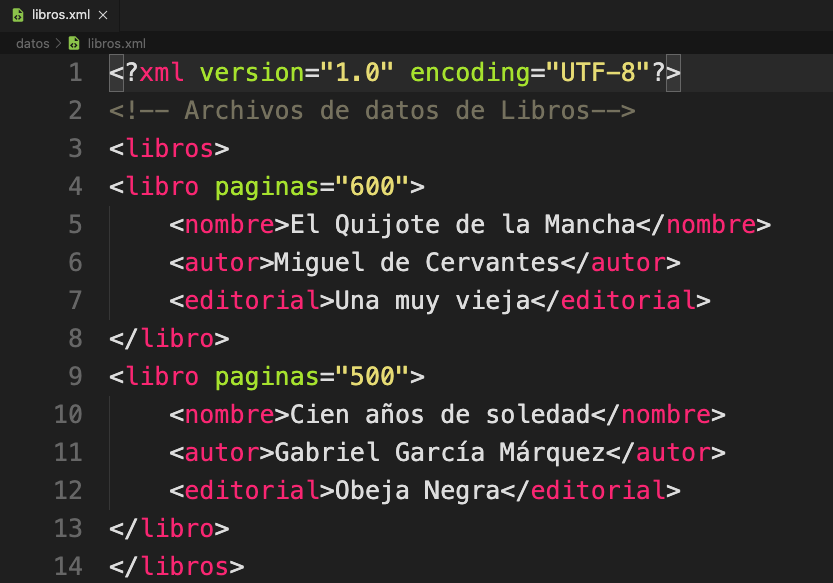

Si lo cargamos en Chrome o Firefox se muestra de la siguiente manera:

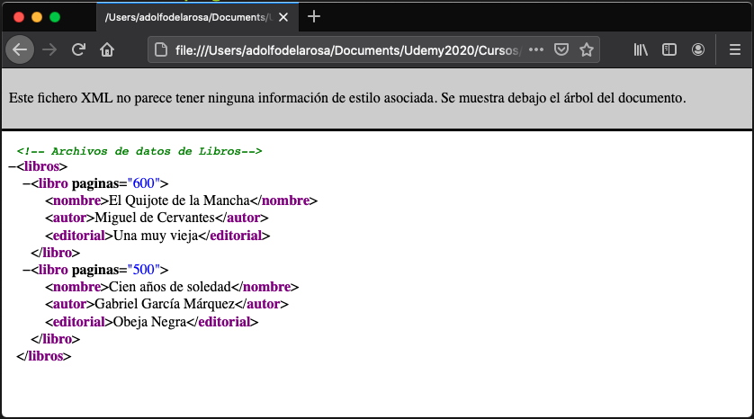
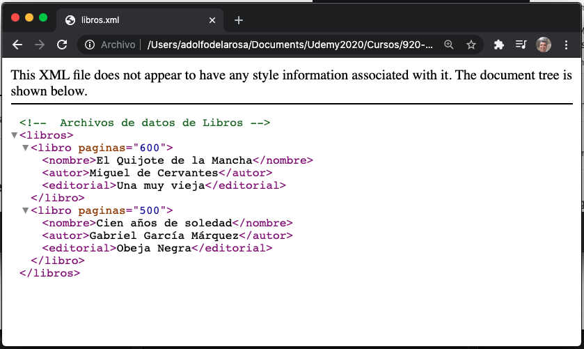

Como no tenemos asociado ningún archivo de estilos el navegador nos pone `Este fichero XML no parece tener ninguna información de estilo asociada. Se muestra debajo el árbol del documento.`.

Vamos a asociarle un archivo CSS a nuestro XML con:

```xml
<?xml-stylesheet type="text/css" href="css/libros.css"?>
```

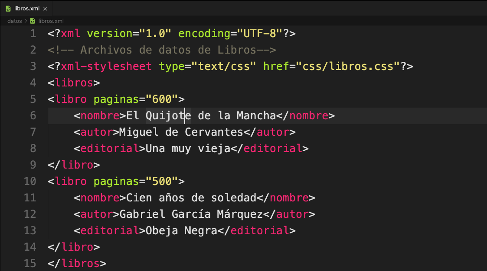
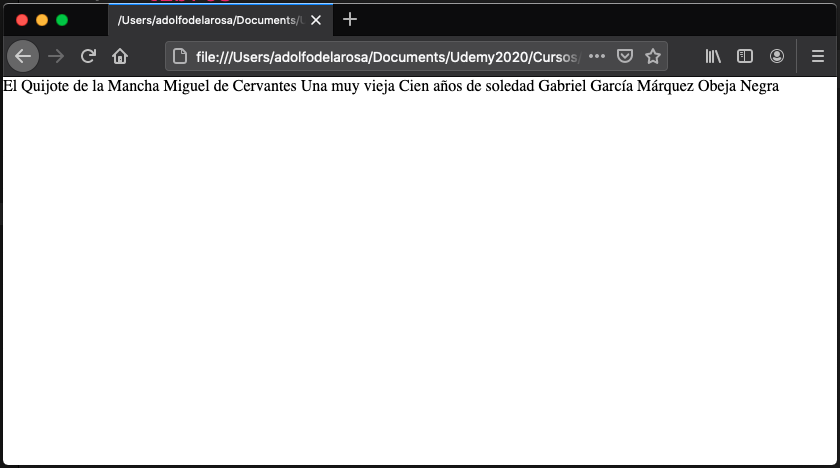
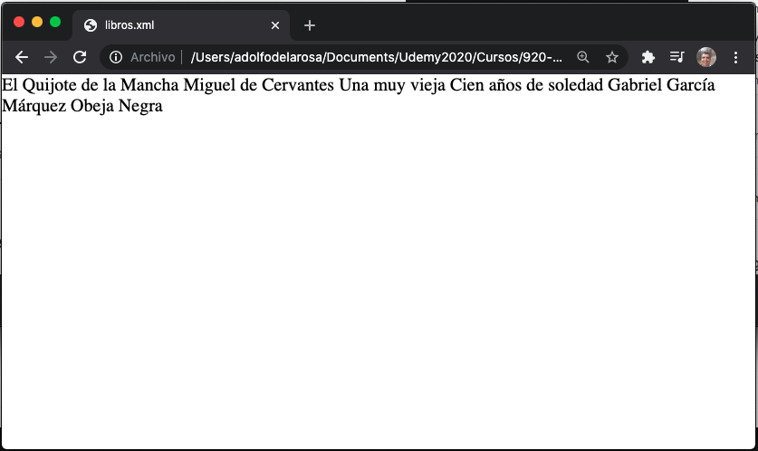

Nuestros navegador ya no lo pone como Arbor lo pone en una sola línea ya que no esta encontrando el archivo de estilo `libros.css`.


## 16.- Crear el Archivo de Estilos en Cascada con las Etiquetas Generales 06:15

Vamos a crear el archivo `libros.css` dentro del directorio `css` con el siguiente contenido:

```css
@charset "UTF-8";
/* CSS Document*/
libros{
    font-size: 18px;
    width: 600px;
}
libro{
    display: block;
    background-color: yellow;
    margin: 5px;
    border: 2px black solid;
}
```

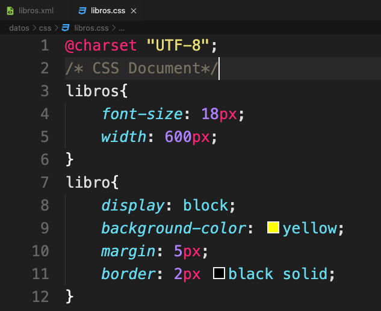

Si cargamos el archivo `libros.xml` vamos a tener:

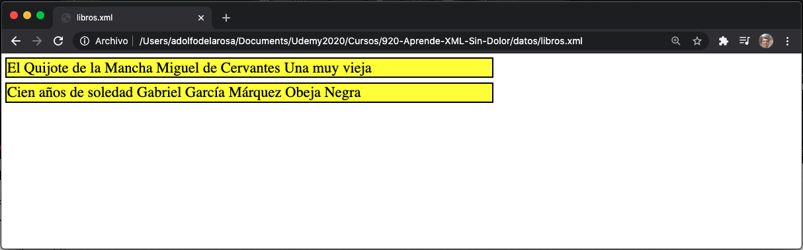

## 17.- Crear los Estilos en Cascada para los Subnodos de XML 06:56

Vamos a añadir estilos para los subnodos de cada libro.

```css
@charset "UTF-8";
/* CSS Document*/
libros{
    font-size: 18px;
    width: 600px;
}
libro{
    display: block;
    background-color: yellow;
    margin: 5px;
    border: 2px black solid;
}
nombre{
    display: block;
    font-size: 24px;
    margin-top: 5px;
    margin-bottom: 5px;
    color: red;
}
autor{
    display: block;
    margin: 5px;
    color: green;
    text-decoration: underline;
}
editorial{
    display: block;
    margin: 5px;
    color: green;
    font-style: italic;
}
```

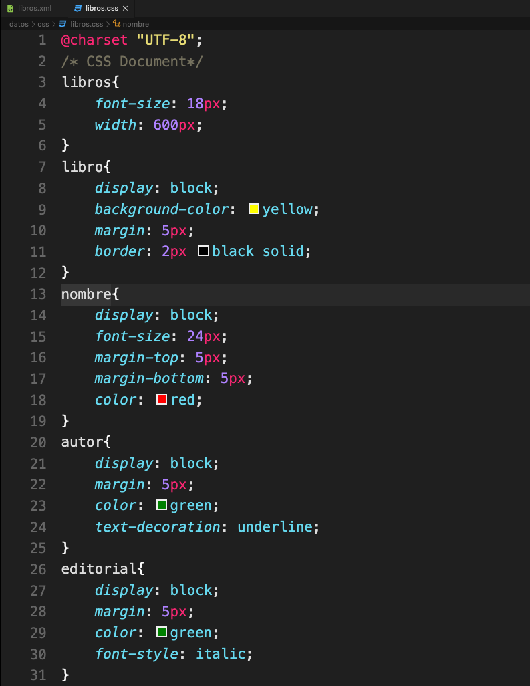

Hemos añadido un nuevo libro.

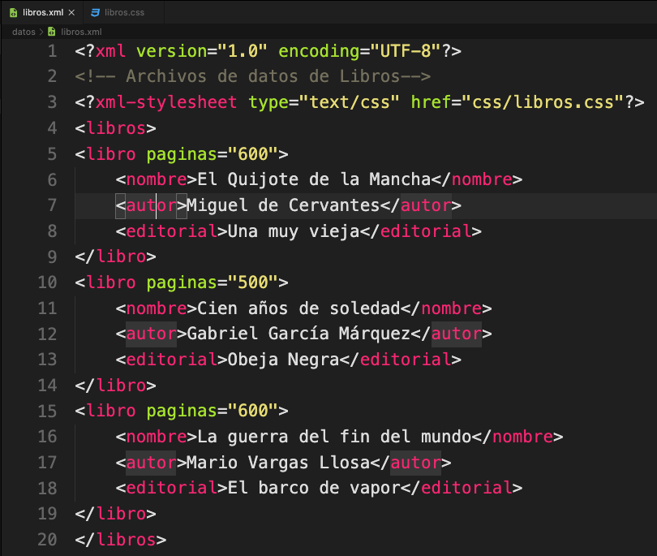

Y al cargar el archivo en el navegador lo vemos de la siguiente forma:

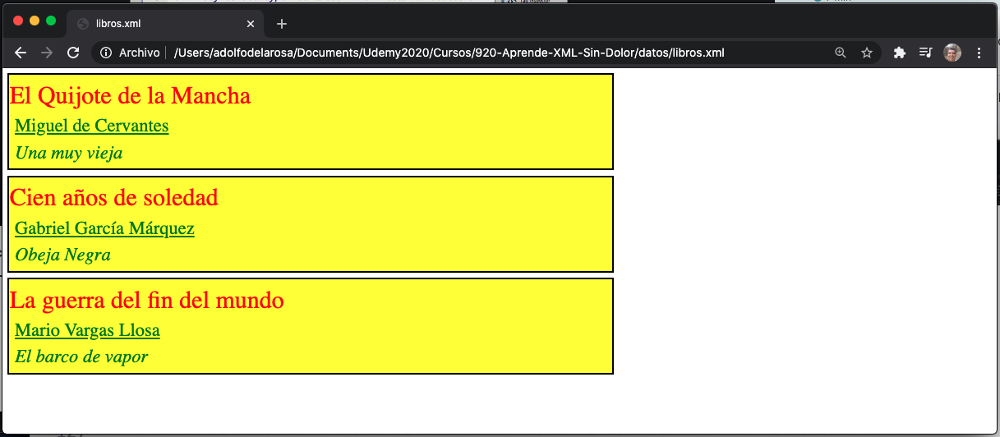


## 18.- Manejar los Atributos y Colocar Cadenas Antes y Después de los Nodos 06:31

Mediante el CSS vamos a hacer que inserte un texto antes de los valores del autor y la editorial, eso lo logramos añadiendo lo siguiente en el CSS.

```css
...
autor{
    display: block;
    margin: 5px;
    color: green;
    text-decoration: underline;
}
/* Lo que indicamos con la instrucción de abajo
   es que antes que desplegar el contenido que tengas 
   en autor pon la cadena "Autor: " la cual mantiene los mismos estilos
*/
autor:before{content: "Autor: ";}
editorial{
    display: block;
    margin: 5px;
    color: green;
    font-style: italic;
}
editorial:before{content: "Editorial: ";}
```

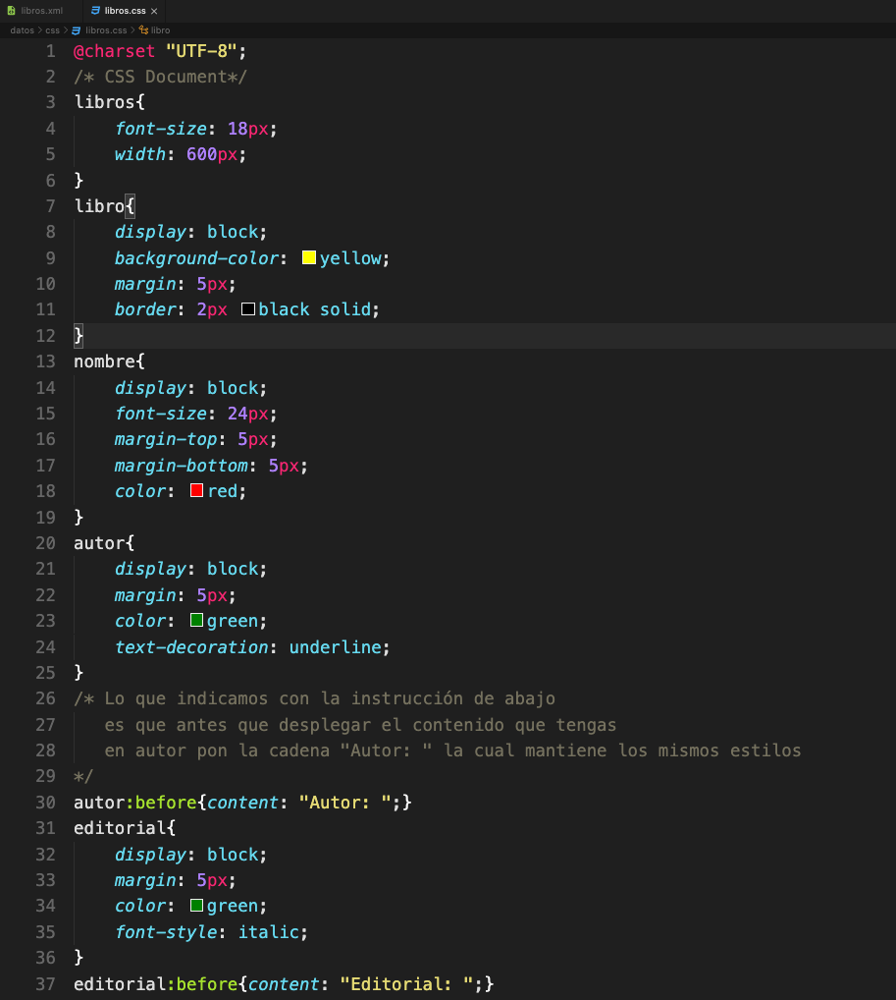

Si cargamos el navegador tenemos:

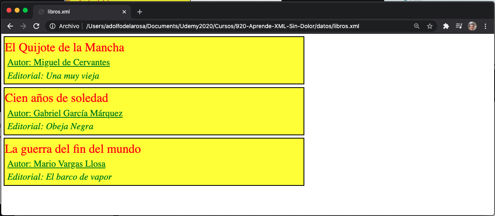

Ya nos pone un texto previo para identificar tanto al *Autor* como a la *Editorial*.

Ahora vamos a hacer que nos pinte el número de páginas después del título del libro, para ello tenemos que hacer un cambio en nuestro archivo `libros.xml`, vamos a cambiar el atributo `paginas` que actualmente tenemos en `libro` lo vamos a poner dentro de la etiqueta `nombre`, nos queda así:

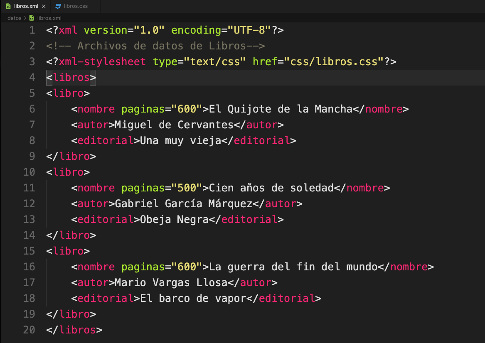

Y en el archivo `libros.css` vamos a insertar:

```css
nombre:after{
    content: ", " attr(paginas) " páginas";
    color: orange;
    font-size: 18px;
}
```
Lo que hace es que *después* de colocar el valor del nombre, coloca el ", XXX páginas" donde XXX es el valor del atributo `paginas` que recuperamos con `attr(paginas)`, con un color `orange` y con un tamaño de `18px`.

Al cargar el archivo `libros.xml` en el navegador vemos lo siguiente:

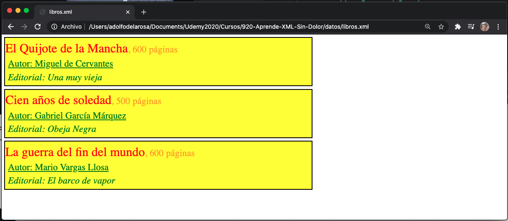

#### :computer: Archivos Finales.

`libro.xml`

```xml
<?xml version="1.0" encoding="UTF-8"?>
<!-- Archivos de datos de Libros-->
<?xml-stylesheet type="text/css" href="css/libros.css"?>
<libros>
<libro>
    <nombre paginas="600">El Quijote de la Mancha</nombre>
    <autor>Miguel de Cervantes</autor>
    <editorial>Una muy vieja</editorial>
</libro>
<libro>
    <nombre paginas="500">Cien años de soledad</nombre>
    <autor>Gabriel García Márquez</autor>
    <editorial>Obeja Negra</editorial>
</libro>
<libro>
    <nombre paginas="600">La guerra del fin del mundo</nombre>
    <autor>Mario Vargas Llosa</autor>
    <editorial>El barco de vapor</editorial>
</libro>
</libros>
```

`libro.css`

```css
@charset "UTF-8";
/* CSS Document*/
libros{
    font-size: 18px;
    width: 600px;
}
libro{
    display: block;
    background-color: yellow;
    margin: 5px;
    border: 2px black solid;
}
nombre{
    display: block;
    font-size: 24px;
    margin-top: 5px;
    margin-bottom: 5px;
    color: red;
}
nombre:after{
    content: ", " attr(paginas) " páginas";
    color: orange;
    font-size: 18px;
}
autor{
    display: block;
    margin: 5px;
    color: green;
    text-decoration: underline;
}
/* Lo que indicamos con la instrucción de abajo
   es que antes que desplegar el contenido que tengas 
   en autor pon la cadena "Autor: " la cual mantiene los mismos estilos
*/
autor:before{content: "Autor: ";}
editorial{
    display: block;
    margin: 5px;
    color: green;
    font-style: italic;
}
editorial:before{content: "Editorial: ";}
```


