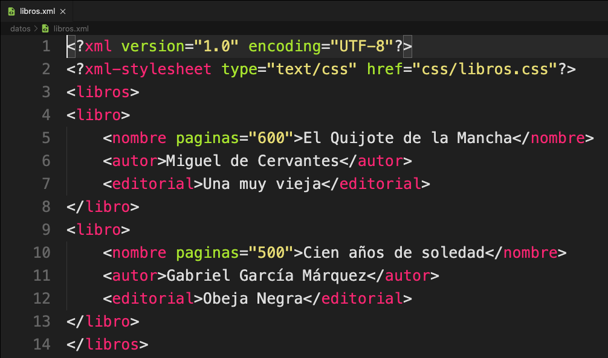
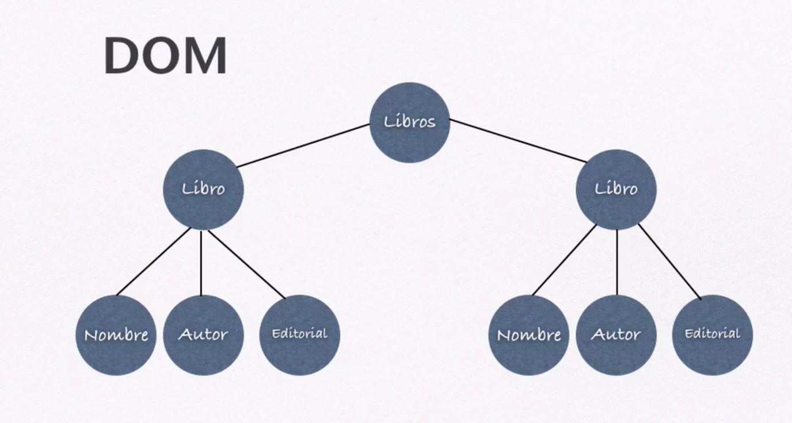
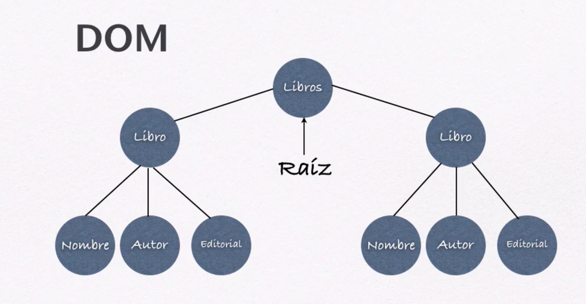
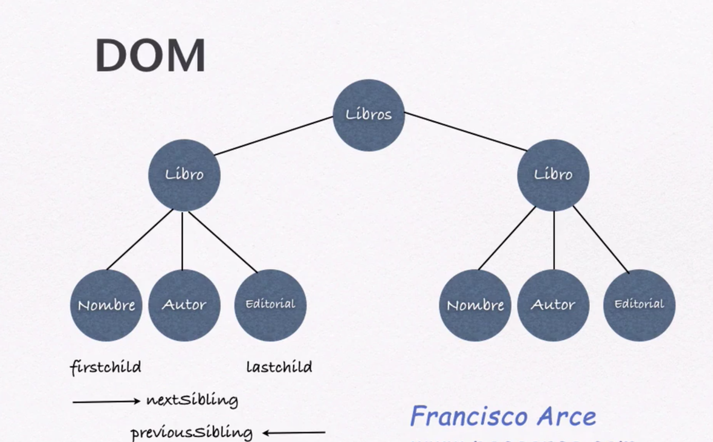

# 03. El Modelo DOM para XML • 6 clases • 48m

* 19.- Introducción al Modelo DOM en XML 04:03
* 20.- Padres, Hijos y Hermanos en XML 06:36
* 21.- Cargar un Archivo XML por medio de XMLHttpRequest 09:36
* 22.- Propiedades y Métodos para Analizar un Archivo XML 07:23
* 23.- Recorrer un Documento XML con las Instrucciones DOM 13:33
* 24.- Extraer el Valor de los Atributos con `getNamedItem()` 06:46

## 19.- Introducción al Modelo DOM en XML 04:03

Existen tres especificaciones para el DOM la de HTML, JS y XML, en este caso la que nos interesa es la de XML.

**DOM** significa Document Object Model o Modelo de Documento de tipo Objeto.

* Creado como estándar en 1998 por la W3C.
* Provee una forma de manipular, crear, cambiar y borrar el contenido de un documento por medio de un script(código).
* El modelo DOM es independiente de la plataforma, navegador o lenguaje de programación.
* Representa a un documento como un árbol y permite acceder a la estructura del mismo.
* En el modelo DOM de XML, TODO es un nodo del árbol:
   * Elementods
   * Instrucciones de proceso
   * CDATA
   * Comentarios
   * Textos o contenidos
* La relación entre nodos es de ***Padre - Hijo***
* En DOM se utiliza en foerma frecuente los terminos:
   * ***child**/ (hijo)
   * ***sibling**/ (hermano)
   * ***ancestor**/ (ancestro)
   * ***descendent**/ (decendiente)

Partiendo de nuestro ejemplo:

La representación en árbol es la siguiente:

En este caso `Libros` es el *padre* de `Libro` y a su vez `Libro` es *hijo* de `Libros`.
`Libro`es *padre* de `Nombre`, `Autor` y `Editorial` o `Nombre`, `Autor` y `Editorial` son *hijos* de `Libro`.
`Libros` es el *ancestro* de `Nombre`, `Autor` y `Editorial` o `Nombre`, `Autor` y `Editorial` son *decendientes* de `Libros`.
`Nombre`, `Autor` y `Editorial` son todos *hermanos o siblings*

## 20.- Padres, Hijos y Hermanos en XML 06:36

* Los nodos tienen una relación jerárquica dentro del árbol.
* Los *nodos padres* tienen *nodos hijos*, también llamados *subnodos*.
* Los *nodos hijos* del mismo padre son conocidos como *hermanos(siblings)*, etc.

Vamos a tener un nodo principal llamado ***Nodo Raíz***, en XML solo puede existir un único nodo raíz.

* Cada nodo, excepto el nodo raíz, tiene un *nodo padre o "parent"*.
* Un nodo puede tener cualquier cantidad de *nodos hijos (child)* o subnodos.
* Un nodo que no tiene hijos se le llama **"leaf"** (hoja) en este caso `Nombre`, `Autor` y `Editorial` son *nodos leaf o nodos hoja*.
* Los nodos que tienen el mismo padre se les considera *nodos hermanos o "siblings"*, en este caso `Nombre`, `Autor` y `Editorial` son *nodos hermanos o siblings*.

* ***firstchild*** es el primero de los hijos de un padre tomandolos de izquierda a derecha.
* ***lastchild*** es el último de los hijos de un padre tomandolos de izquierda a derecha.
* ***nextSibling*** es una funcionalidad que nos permite pasar al siguiente hermano, siempre de izquierda a derecha.
* ***previousSibling*** es una funcionalidad que nos permite regresar al hermano previo.

Gracias a que la estructura de un archivo XML se puede representar como un árbol, podemos recorrerlo sin saber su estructura exacta y sin conocer los datos que contiene.

## 21.- Cargar un Archivo XML por medio de XMLHttpRequest 09:36
## 22.- Propiedades y Métodos para Analizar un Archivo XML 07:23
## 23.- Recorrer un Documento XML con las Instrucciones DOM 13:33
## 24.- Extraer el Valor de los Atributos con `getNamedItem()` 06:46
