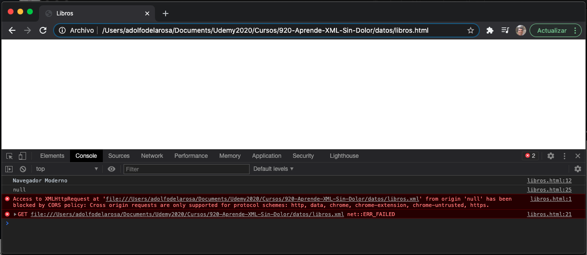
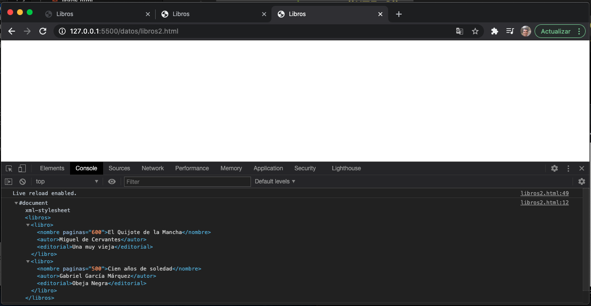

# 03. El Modelo DOM para XML • 6 clases • 48m

* 19.- Introducción al Modelo DOM en XML 04:03
* 20.- Padres, Hijos y Hermanos en XML 06:36
* 21.- Cargar un Archivo XML por medio de XMLHttpRequest 09:36
* 22.- Propiedades y Métodos para Analizar un Archivo XML 07:23
* 23.- Recorrer un Documento XML con las Instrucciones DOM 13:33
* 24.- Extraer el Valor de los Atributos con `getNamedItem()` 06:46

## 19.- Introducción al Modelo DOM en XML 04:03

Existen tres especificaciones para el DOM la de HTML, JS y XML, en este caso la que nos interesa es la de XML.

**DOM** significa Document Object Model o Modelo de Documento de tipo Objeto.

* Creado como estándar en 1998 por la W3C.
* Provee una forma de manipular, crear, cambiar y borrar el contenido de un documento por medio de un script(código).
* El modelo DOM es independiente de la plataforma, navegador o lenguaje de programación.
* Representa a un documento como un árbol y permite acceder a la estructura del mismo.
* En el modelo DOM de XML, TODO es un nodo del árbol:
   * Elementods
   * Instrucciones de proceso
   * CDATA
   * Comentarios
   * Textos o contenidos
* La relación entre nodos es de ***Padre - Hijo***
* En DOM se utiliza en foerma frecuente los terminos:
   * ***child**/ (hijo)
   * ***sibling**/ (hermano)
   * ***ancestor**/ (ancestro)
   * ***descendent**/ (decendiente)

Partiendo de nuestro ejemplo:


La representación en árbol es la siguiente:


En este caso `Libros` es el *padre* de `Libro` y a su vez `Libro` es *hijo* de `Libros`.
`Libro`es *padre* de `Nombre`, `Autor` y `Editorial` o `Nombre`, `Autor` y `Editorial` son *hijos* de `Libro`.
`Libros` es el *ancestro* de `Nombre`, `Autor` y `Editorial` o `Nombre`, `Autor` y `Editorial` son *decendientes* de `Libros`.
`Nombre`, `Autor` y `Editorial` son todos *hermanos o siblings*

## 20.- Padres, Hijos y Hermanos en XML 06:36

* Los nodos tienen una relación jerárquica dentro del árbol.
* Los *nodos padres* tienen *nodos hijos*, también llamados *subnodos*.
* Los *nodos hijos* del mismo padre son conocidos como *hermanos(siblings)*, etc.

Vamos a tener un nodo principal llamado ***Nodo Raíz***, en XML solo puede existir un único nodo raíz.


* Cada nodo, excepto el nodo raíz, tiene un *nodo padre o "parent"*.
* Un nodo puede tener cualquier cantidad de *nodos hijos (child)* o subnodos.
* Un nodo que no tiene hijos se le llama **"leaf"** (hoja) en este caso `Nombre`, `Autor` y `Editorial` son *nodos leaf o nodos hoja*.
* Los nodos que tienen el mismo padre se les considera *nodos hermanos o "siblings"*, en este caso `Nombre`, `Autor` y `Editorial` son *nodos hermanos o siblings*.


* ***firstchild*** es el primero de los hijos de un padre tomandolos de izquierda a derecha.
* ***lastchild*** es el último de los hijos de un padre tomandolos de izquierda a derecha.
* ***nextSibling*** es una funcionalidad que nos permite pasar al siguiente hermano, siempre de izquierda a derecha.
* ***previousSibling*** es una funcionalidad que nos permite regresar al hermano previo.

Gracias a que la estructura de un archivo XML se puede representar como un árbol, podemos recorrerlo sin saber su estructura exacta y sin conocer los datos que contiene.

## 21.- Cargar un Archivo XML por medio de XMLHttpRequest 09:36

En esta lección vamos a ver como cargar un archivo XML dentro de un HTML, existe la posibilidad de escribir el contenido XML directamente en el HTML por medio de una etiqueta pero es más común que esté contenido en su propio archivo XML. Esto también se puede deber que existan procesos como los Web Services que nos proveen ya estos archivos XML directamente y desde el HTML solo queremos cargarlos.

Vamos a crear el archivo HTML `libros.html` con el siguiente contenido:

```html
<!DOCTYPE html>
<html lang="en">
<head>
   <meta charset="UTF-8">
   <meta http-equiv="X-UA-Compatible" content="IE=edge">
   <meta name="viewport" content="width=device-width, initial-scale=1.0">
   <title>Libros</title>
   <script>
      //Crear Objeto XMLHttpRequest dependiendo del navegador
      if(window.XMLHttpRequest){
         xhttp = new XMLHttpRequest();
         console.log("Navegador Moderno")
      }else{
         //IE 5-6
         xhttp = new ActiveXObject("Microsoft.XMLHTTP");
      }
      //Leer archivo "libros.xml" por medio de un GET y no lo interprete
      xhttp.open("GET", "libros.xml", false);
        
      //Envia la petición
      xhttp.send();

      //Recupera la respuesta interpretandola como un XML
      xmlDoc = xhttp.responseXML;
      console.log(xmlDoc);
   </script>
</head>
<body>
    
</body>
</html>
```

Este archivo HTML contiene un bloque JavaScript donde hacemos la carga del archivo `libros.xml`.

Usamos el objeto `XMLHttpRequest` que nos permite cargar datos en el background y nos permite hacer infinidad de cosas en el HTML entre ellas el AJAX.

Dependiendo del navegador que estemos usando vamos a crear el objeto `XMLHttpRequest` de una forma u otra ya que Internet Explorer 6 e inferiores no cuentan con este objeto lo crean de forma diferente.

Una vez que ya tenemos creado nuestro objeto `XMLHttpRequest` vamos a usar el método `open` donde le indicamos que vamos a leer el archivo `libros.xml` (si estuvierá en otra ruta se le indicaría) por medio del método `GET`, el parámetro `false` nos permite indicarle que no interprete lo que leemos.

Si cargamos el archivo `libros.html` no va a pasar nada, por que aún no estamos haciendo nada con la respuesta obtenida, simplemente estamos mostrando unos mensajes en la consola para seguir la traza de lo que se esta haciendo.



Vemos que si cargamos directamente este archivo en el navegador nos muestra algunos errores con respecto al CORS esto es por que no estamos usando un servidor para cargar el archivo.

Desde VSC vamos a abrir el Archivo con **Live Server**.


Esto nos abrirá el mismo archivo dentro del Servidor.


Como podemos observar ya no nos marca los errores del CORS.

Pero también observamos que no nos carga el resultado de leer el archivo `libros.xml` ya que nos lo esta colocando como `null`.

Revisando el tutorial de [XML de W3School](https://www.w3schools.com/xml/default.asp) hay otra forma de crear el HTML y parece que si nos regresa un valor como respuesta de la lectura del archivo `libros.xml`.

Vamos a crear el archivo alternativo HTML que llamaremos `libros2.html` con el siguiente contenido:

`libros2.html`

```html
<!DOCTYPE html>
<html lang="en">
<head>
   <meta charset="UTF-8">
   <meta http-equiv="X-UA-Compatible" content="IE=edge">
   <meta name="viewport" content="width=device-width, initial-scale=1.0">
   <title>Libros</title>
   <script>
      var xhttp = new XMLHttpRequest();
      xhttp.onreadystatechange = function() {
         if (this.readyState == 4 && this.status == 200) {
            console.log(xhttp.responseXML);    
         }
      };
      xhttp.open("GET", "libros.xml", true);
      xhttp.send();      
   </script>
</head>
<body>
    
</body>
</html>
```



## 22.- Propiedades y Métodos para Analizar un Archivo XML 07:23

### Propiedades

Algunas de las propiedades que nos van a permitir trabajar con archivos XML son las siguientes:

* `x.nodeName`: Nos devuelve el nombre del nodo x.
* `x.nodeValue`: Nos devuelve el valor del nodo x.
* `x.parentNode`: Nos devuelve el nombre del nodo padre del nodo x.
* `x.childNodes`: Nos devuelve los nodos hijos del nodo x en un `array`.
* `x.attributes`: Nos devuelve los atributos del nodo x en un `array`.

### Métodos

Algunas de los métodos que nos van a permitir trabajar con archivos XML son los siguientes:

* `x.getElementsByTagName(nombre)`: Selecciona los elementos con el nombre de etiqueta especificado.
* `x.appendChild(nod)`: Inserta un subnodo en x.
* `x.removeChild(nodo)`: Elimina el subnodo "nodo" del elemento x.

### Ejemplo de XML-DOM

La representación en árbol que ya habíamos visto es la siguiente:


Si usamos la siguiente instrucción:

```xml
libro = xmlDoc.getElementsByTagName("nombre")[0].childNodes[0].nodeValue;
```

Lo que estamos haciendo es que tomamos nuestro objeto `xmlDoc` que ya nos retorna todo el contenido de nuestro archivo `libros.xml` del cual con el método `getElementsByTagName("nombre")` vamos a obtener todos los elementos que tengan como nombre de etiqueta `"nombre"`, si vemos el arbol hay dos elementos con una etiqueta llamada `"nombre"`,  esto nos lo retorna en un array, del cual estamos tomando el primer elemento gracias a que estamos usando `[0]`, una vez que ya tenemos ese primer elemento `nombre` en nuestro diagrama vemos que es un elemento hoja, en teoría ya no tiene hijos, pero realmente el texto de este elemento es un hijo del elemento y lo estamos recuperando con `childNodes` esto recupera un array con todos los hijos, para recuperar el primer elemento de ese array usamos `childNodes[0]` que es el único que hay y con `nodeValue` vamos a recuperar el valor del texto que en teoría debería ser: `El Quijote de la Mancha`.

Vamos a editar nuestro archivo `libros2.html`

```html
<!DOCTYPE html>
<html lang="en">
<head>
   <meta charset="UTF-8">
   <meta http-equiv="X-UA-Compatible" content="IE=edge">
   <meta name="viewport" content="width=device-width, initial-scale=1.0">
   <title>Libros</title>
   <script>
      var xhttp = new XMLHttpRequest();
      xhttp.onreadystatechange = function() {
         if (this.readyState == 4 && this.status == 200) {
            xmlDoc = xhttp.responseXML;
            titulo = xmlDoc.getElementsByTagName("nombre")[0].childNodes[0].nodeValue;
            console.log("Título: " + titulo);
         }
      };
      xhttp.open("GET", "libros.xml", true);
      xhttp.send();      
   </script>
</head>
<body>
    
</body>
</html>
```

Al cargar el archivo en el navegador vamos a tener:


Si cambiamos 

```html
titulo = xmlDoc.getElementsByTagName("nombre")[0].childNodes[0].nodeValue;
```

Por 

```html
titulo = xmlDoc.getElementsByTagName("nombre")[1].childNodes[0].nodeValue;
```


Por 

```html
titulo = xmlDoc.getElementsByTagName("nombre")[2].childNodes[0].nodeValue;
```


Por 

```html
titulo = xmlDoc.getElementsByTagName("nombre")[3].childNodes[0].nodeValue;
```

En este caso como ya no existe un cuarto nodo nos manda el siguiente error:


## 23.- Recorrer un Documento XML con las Instrucciones DOM 13:33

Ahora lo que vamos a hacer son diferentes Scripts para recorrer el Documento XML mediante el árbol XML representado por el DOM.

Lo primero que vamos a hacer es un ***script para que nos despliegue la lista de todos los títulos de los libros*** contenidos en el archivo `libros.xml`.

Lo vamos a hacer el el archivo `libros3.html`

```html
<!DOCTYPE html>
<html lang="en">
<head>
   <meta charset="UTF-8">
   <meta http-equiv="X-UA-Compatible" content="IE=edge">
   <meta name="viewport" content="width=device-width, initial-scale=1.0">
   <title>Libros</title>
   <script>
      var xhttp = new XMLHttpRequest();
      xhttp.onreadystatechange = function() {
         if (this.readyState == 4 && this.status == 200) {
            xmlDoc = xhttp.responseXML;
            titulos = xmlDoc.getElementsByTagName("nombre");
            for(var i=0; i < titulos.length; i++){
               document.write(titulos[i].childNodes[0].nodeValue + "<br>");
            }
         }
      };
      xhttp.open("GET", "libros.xml", true);
      xhttp.send();      
   </script>
</head>
<body>
    
</body>
</html>
```

En el navegador tenemos:


### Tipos de Nodos

Dentro de los archivos XML se pueden tener diferentes tipos de nodos.

Tipo de Nodo | Nombre de Constante
-------------|--------------------
1 | ELEMENT_NODE
2 | ATTRIBUTE_NODE
3 | TEXT_NODE
4 | CDATA_SECTION_NODE
5 | ENTITY_REFERENCE_NODE
6 | ENTITY_NODE
7 | PROCESSING_INSTRUCTION_NODE
8 | COMMENT_NODE
9 | DOCUMENT_NODE
10 | DOCUMENT_TYPE_NODE
11 | DOCUMENT_FRAGMENT_NODE
12 | NOTATION_NODE


## 24.- Extraer el Valor de los Atributos con `getNamedItem()` 06:46
