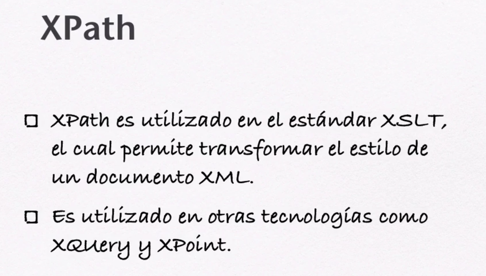

# 04. La Herramienta XPath • 8 clases • 41m

* 25.- Introducción a XPath 04:16
* 26.- Elementos de una Cadena XPath 04:20
* 27.- Cargar un Archivo Externo con `XMLHttpRequest` 09:35
* 28.- Utilizar las Instrucciones `xml.evaluate()` y `xml.iterateNext()` 08:39
* 29.- Evaluar una Expresión XPath en Internet Explorer 05:11
* 30.- Los Arreglos de Datos en XPath 02:07
* 31.- Uso de Predicados en las Expresiones XPath 02:41
* 32.- Seleccionar los Nodos Bajo un Criterio en XPath 04:32

## 25.- Introducción a XPath 04:16


En esencia vamos a generar una cadena que nos va a permitir navegar a través del XML.




## 26.- Elementos de una Cadena XPath 04:20


## 27.- Cargar un Archivo Externo con `XMLHttpRequest` 09:35

Vamos a partir del archivo XML que hemos ido trabajando pero a cada libro le vamos a añadir dos subnodos más `precio` y `fecha` lo llamaremos `4001_libros_con_xpath.xml`:

```xml
<?xml version="1.0" encoding="UTF-8"?>
<?xml-stylesheet type="text/css" href="css/libros.css"?>
<libros>
<libro>
    <nombre paginas="600">El Quijote de la Mancha</nombre>
    <autor>Miguel de Cervantes</autor>
    <editorial>Una muy vieja</editorial>
    <precio>200.00</precio>
    <fecha>2005</fecha>
</libro>
<libro>
    <nombre paginas="500">Cien años de soledad</nombre>
    <autor>Gabriel García Márquez</autor>
    <editorial>Obeja Negra</editorial>
    <precio>300.00</precio>
    <fecha>2000</fecha>
</libro>
<libro>
    <nombre paginas="600">La guerra del fin del mundo</nombre>
    <autor>Mario Vargas Llosa</autor>
    <editorial>El barco de vapor</editorial>
    <precio>350.00</precio>
    <fecha>2010</fecha>
</libro>
</libros>
```

Ahora vamos a cargar este archivo XML mediante `XMLHttpRequest` en un archivo HTML llamado `4002_libros_con_xpath.html`:

```html
<!DOCTYPE html>
<html>
<head>
    <meta charset='utf-8'>
    <meta http-equiv='X-UA-Compatible' content='IE=edge'>
    <title>XPath 01</title>
    <meta name='viewport' content='width=device-width, initial-scale=1'>
    <script>
        /*
        var xhttp = new XMLHttpRequest();
      xhttp.onreadystatechange = function() {
         if (this.readyState == 4 && this.status == 200) {
            console.log(xhttp.responseXML);    
         }
      };
      xhttp.open("GET", "02_libros_con_css.xml", true);
      xhttp.send(); 
        */
        function cargaXML(archivo){
            if(window.XMLHttpRequest){
                xhttp = new XMLHttpRequest();
            }else{
                xhttp = new ActiveXObject("Microsoft.XMLHTTP")
            }
            xhttp.open("GET", archivo, false);
            try{
                xhttp.responseType = "msxml-document";
            }catch(err){};
            xhttp.send("");
            return xhttp;
        }
        window.onload = function(){
            var x = cargaXML("4001_libros_con_xpath.xml");
            var xml = x.responseXML;
            var path = "libros/libro/nombre";
            console.log(xml);
        }
    </script>
</head>
<body>
    
</body>
</html>
```


`4003_libros_con_xpath.html`

```html
<!DOCTYPE html>
<html>
<head>
    <meta charset='utf-8'>
    <meta http-equiv='X-UA-Compatible' content='IE=edge'>
    <title>XPath 01</title>
    <meta name='viewport' content='width=device-width, initial-scale=1'>
    <script>
        function cargaXML(archivo){
            var xhttp = new XMLHttpRequest();
            xhttp.onreadystatechange = function() {
                if (this.readyState == 4 && this.status == 200) {
                    console.log(xhttp.responseXML); 

                    var xml = xhttp.responseXML
                    var path = "/libros/libro/nombre";
                    console.log(xml);
                    var libros = xml.evaluate(path, xml, null, XPathResult.ANY_TYPE, null);
                    console.log(libros);

                    var libro = libros.iterateNext();
                    while(libro){
                        document.write(libro.childNodes[0].nodeValue);
                        document.write("<br>");
                        libro = libros.iterateNext();
                    } 
                }
            };
            xhttp.open("GET", archivo, true);
            xhttp.send(); 
        }
        window.onload = function(){
            console.log("CARGADO.....");
            var x = cargaXML("4001_libros_con_xpath.xml");
        }
    </script>
</head>
<body>
    
</body>
</html>
```


`4004_libros_con_xpath.html`

```html
<!DOCTYPE html>
<html>
<head>
    <meta charset='utf-8'>
    <meta http-equiv='X-UA-Compatible' content='IE=edge'>
    <title>XPath 01</title>
    <meta name='viewport' content='width=device-width, initial-scale=1'>
    <script>
        function cargaXML(archivo){
            var xhttp = new XMLHttpRequest();
            xhttp.onreadystatechange = function() {
                if (this.readyState == 4 && this.status == 200) {
                    console.log(xhttp.responseXML); 
                    var xml = xhttp.responseXML
                    //Obtiene el primer libro, en XPATH el indice empieza en 1
                    var path = "/libros/libro[1]/nombre";
                    var libros = xml.evaluate(path, xml, null, XPathResult.ANY_TYPE, null);
                    var libro = libros.iterateNext();
                    document.write(libro.childNodes[0].nodeValue);
                    document.write("<br>"); 
                }
            };
            xhttp.open("GET", archivo, true);
            xhttp.send(); 
        }
        window.onload = function(){
            console.log("CARGADO.....");
            var x = cargaXML("4001_libros_con_xpath.xml");
        }
    </script>
</head>
<body>
    
</body>
</html>
```


`4005_libros_con_xpath.html`

```html
<!DOCTYPE html>
<html>
<head>
    <meta charset='utf-8'>
    <meta http-equiv='X-UA-Compatible' content='IE=edge'>
    <title>XPath 01</title>
    <meta name='viewport' content='width=device-width, initial-scale=1'>
    <script>
        function cargaXML(archivo){
            var xhttp = new XMLHttpRequest();
            xhttp.onreadystatechange = function() {
                if (this.readyState == 4 && this.status == 200) {
                    console.log(xhttp.responseXML); 
                    var xml = xhttp.responseXML
                    var path = "/libros/libro/autor[text()]"; //Con text() traemos los textos 
                    var libros = xml.evaluate(path, xml, null, XPathResult.ANY_TYPE, null);
                    var libro = libros.iterateNext();
                    while(libro){
                        document.write(libro.childNodes[0].nodeValue);
                        document.write("<br>");
                        libro = libros.iterateNext();
                    } 
                }
            };
            xhttp.open("GET", archivo, true);
            xhttp.send(); 
        }
        window.onload = function(){
            console.log("CARGADO.....");
            var x = cargaXML("4001_libros_con_xpath.xml");
        }
    </script>
</head>
<body>
    
</body>
</html>
```


`4006_libros_con_xpath.html`

```html
<!DOCTYPE html>
<html>
<head>
    <meta charset='utf-8'>
    <meta http-equiv='X-UA-Compatible' content='IE=edge'>
    <title>XPath 01</title>
    <meta name='viewport' content='width=device-width, initial-scale=1'>
    <script>
        function cargaXML(archivo){
            var xhttp = new XMLHttpRequest();
            xhttp.onreadystatechange = function() {
                if (this.readyState == 4 && this.status == 200) {
                    console.log(xhttp.responseXML); 
                    var xml = xhttp.responseXML
                    var path = "/libros/libro/autor[text()]";
                    var libros = xml.evaluate(path, xml, null, XPathResult.ANY_TYPE, null);
                    var libro = libros.iterateNext();
                    document.write("<select>");
                    while(libro){
                        document.write("<option>");
                        document.write(libro.childNodes[0].nodeValue);
                        libro = libros.iterateNext();
                        document.write("</option>");
                    }
                    document.write("</select>");
                }
            };
            xhttp.open("GET", archivo, true);
            xhttp.send(); 
        }
        window.onload = function(){
            console.log("CARGADO.....");
            var x = cargaXML("4001_libros_con_xpath.xml");
        }
    </script>
</head>
<body>
```


`4007_libros_con_xpath.html`

```html
<!DOCTYPE html>
<html>
<head>
    <meta charset='utf-8'>
    <meta http-equiv='X-UA-Compatible' content='IE=edge'>
    <title>XPath 01</title>
    <meta name='viewport' content='width=device-width, initial-scale=1'>
    <script>
        function cargaXML(archivo){
            var xhttp = new XMLHttpRequest();
            xhttp.onreadystatechange = function() {
                if (this.readyState == 4 && this.status == 200) {
                    console.log(xhttp.responseXML); 
                    var xml = xhttp.responseXML
                    //var path = "/libros/libro[precio>=300]/nombre";
                    //var path = "/libros/libro[fecha<=2008]/autor";
                    var path = "/libros/libro[precio>=300]/precio";
                    var libros = xml.evaluate(path, xml, null, XPathResult.ANY_TYPE, null);
                    var libro = libros.iterateNext();
                    document.write("<select>");
                    while(libro){
                        document.write("<option>");
                        document.write(libro.childNodes[0].nodeValue);
                        libro = libros.iterateNext();
                        document.write("</option>");
                    }
                    document.write("</select>");
                }
            };
            xhttp.open("GET", archivo, true);
            xhttp.send(); 
        }
        window.onload = function(){
            console.log("CARGADO.....");
            var x = cargaXML("4001_libros_con_xpath.xml");
        }
    </script>
</head>
<body>
    
</body>
</html>
```


## 27.- Cargar un Archivo Externo con `XMLHttpRequest` 09:35s 
## 28.- Utilizar las Instrucciones `xml.evaluate()` y `xml.iterateNext()` 08:39
## 29.- Evaluar una Expresión XPath en Internet Explorer 05:11
## 30.- Los Arreglos de Datos en XPath 02:07
## 31.- Uso de Predicados en las Expresiones XPath 02:41
## 32.- Seleccionar los Nodos Bajo un Criterio en XPath 04:32
