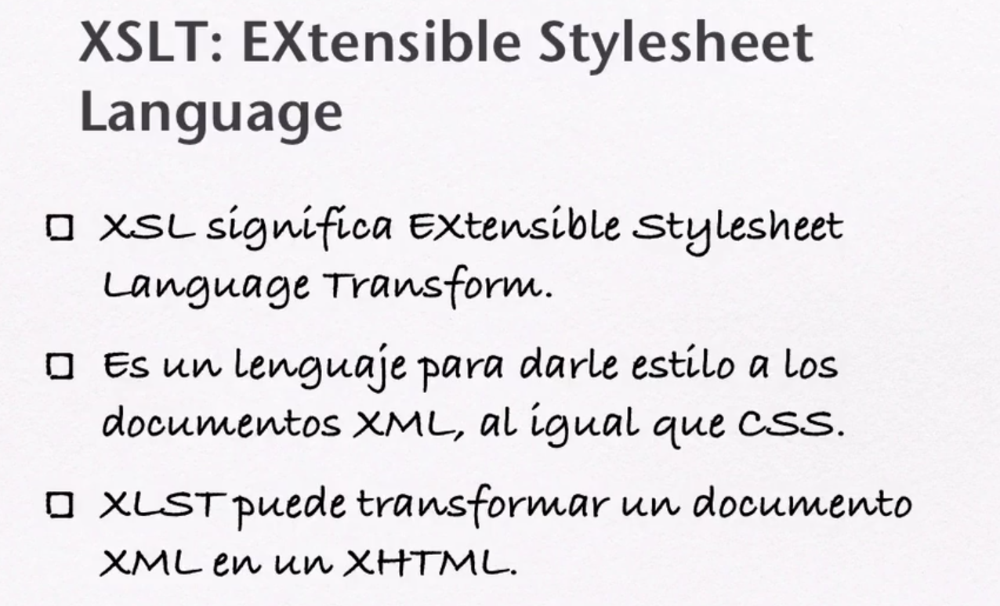
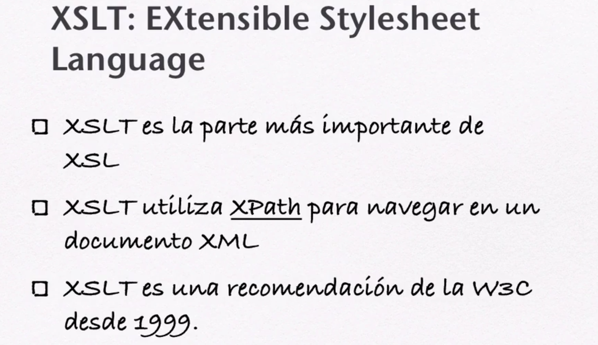
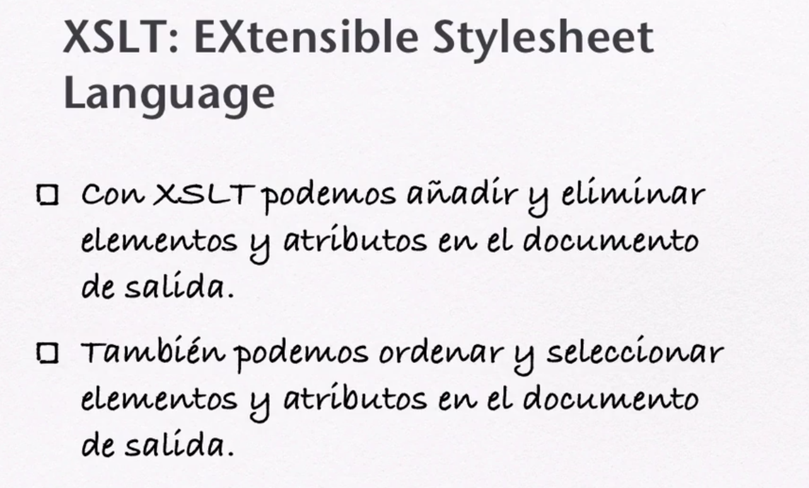
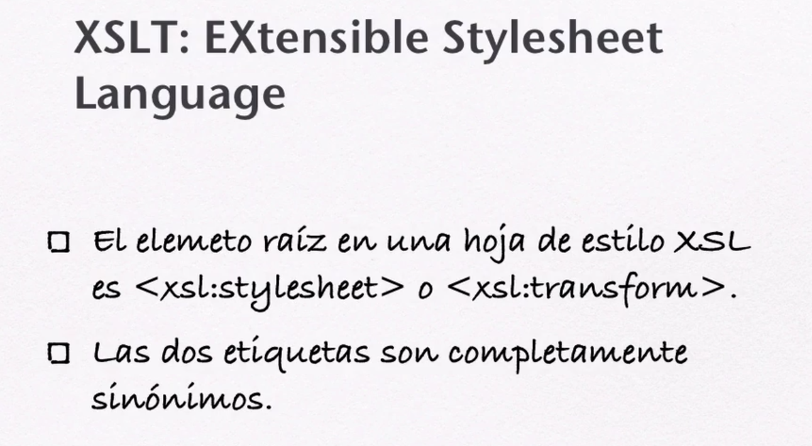
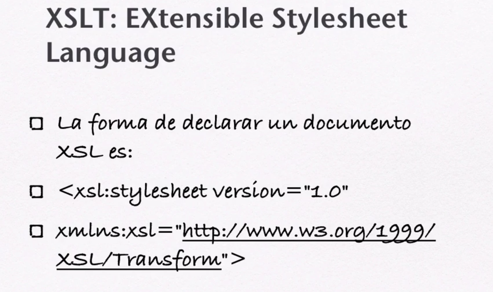
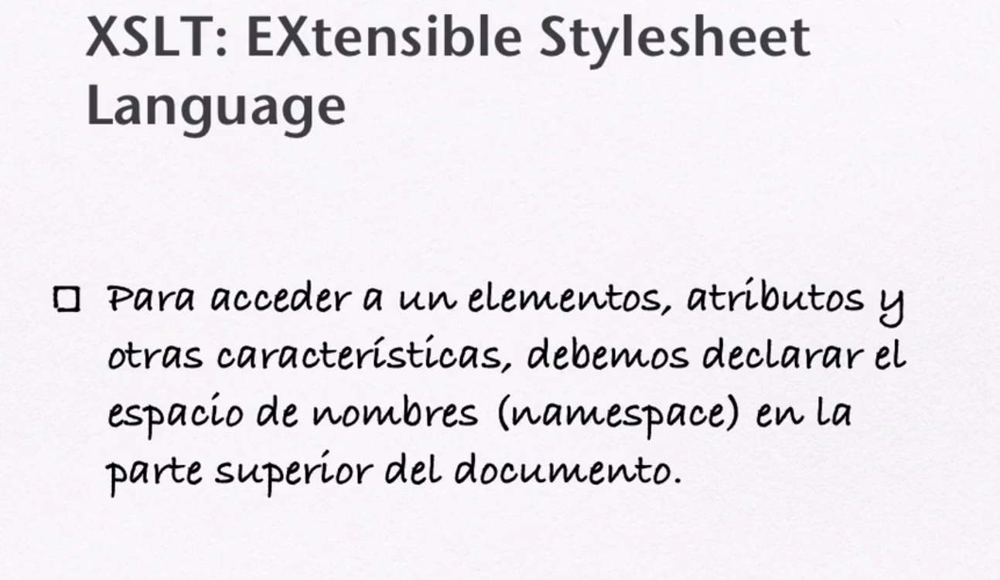
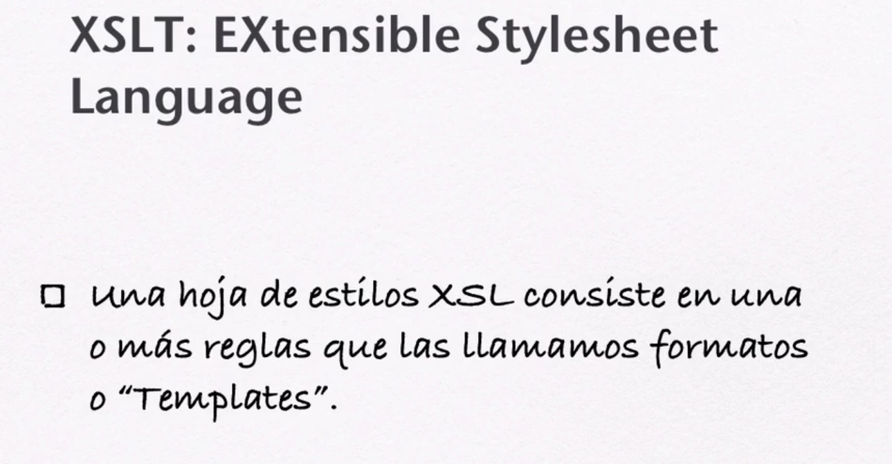
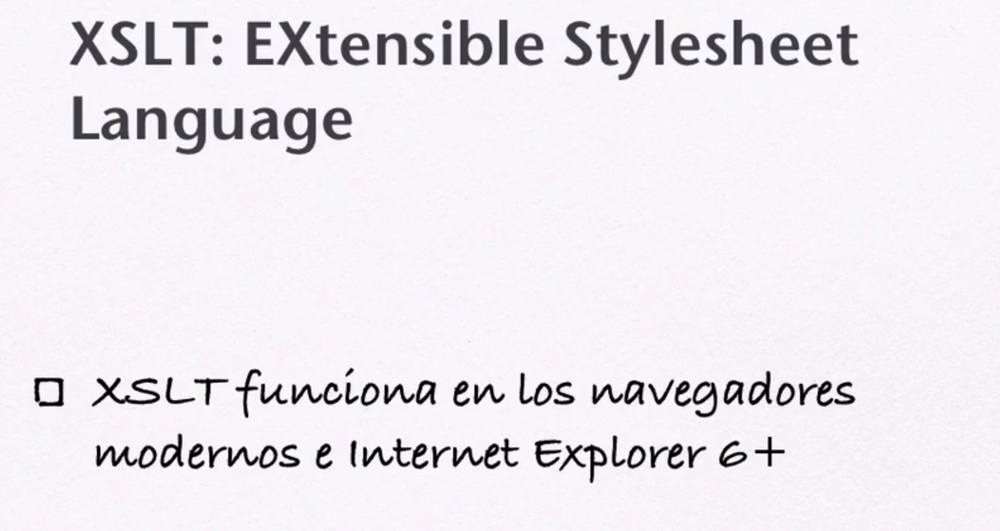

# 05. XSLT:EXtensible Stylesheet Language • 8 clases • 41m  

* 33.- Introducción a XSLT 06:44
* 34.- Crear un Template con XSL 09:59
* 35.- Extraer los Datos de un Documento XML con `value-of` 03:38
* 36.- Hacer un Ciclo en XSL con la Etiqueta `<xsl:for-each>` 03:50
* 37.- Realizar un Filtro por Medio de la Etiqueta `<xsl:for-each>` 05:01
* 38.- Ordenar una Selección por Medio de la Etiqueta `<xsl:sort>` 02:51
* 39.- Crear una Sentencia Condicional con `<xsl:if>` 03:46
* 40.- Sentencias Condicionales con `<choose>` 05:30

## 33.- Introducción a XSLT 06:44

## 34.- Crear un Template con XSL 09:59
## 35.- Extraer los Datos de un Documento XML con `value-of` 03:38
## 36.- Hacer un Ciclo en XSL con la Etiqueta `<xsl:for-each>` 03:50
## 37.- Realizar un Filtro por Medio de la Etiqueta `<xsl:for-each>` 05:01
## 38.- Ordenar una Selección por Medio de la Etiqueta `<xsl:sort>` 02:51
## 39.- Crear una Sentencia Condicional con `<xsl:if>` 03:46
## 40.- Sentencias Condicionales con `<choose>` 05:30
